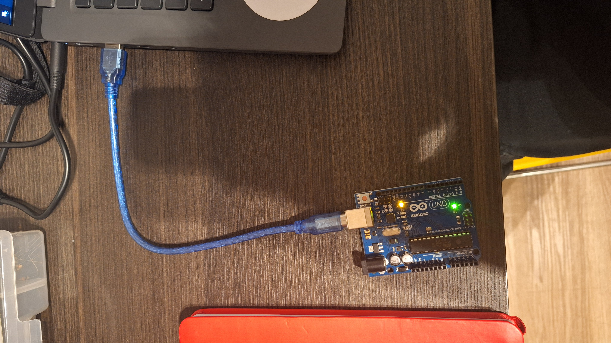

# Parte 1: Blink Led Interno

&ensp; O seguinte documento visa explorar o desenvolvimento da ponderada "Tutorial: LED Interno".

## Comando da Entrega 1

&ensp; Você vai fazer o led ficar aceso por um tempo X, apagar e aguardar Y segundos e depois voltar a acender, propondo um loop que gera uma "luz piscando".

&ensp; Em seu GitHub pessoal (usando sua conta com email Inteli), inserir screenshots de sua tela com o IDE e seu código, além de uma fotografia que demonstre seu Arduino ligado no computador e o seu led aceso. Você também poderá enviar um vídeo que evidencie esse funcionamento.

## Evidências da Entrega 1

### Foto Arduino com LED BUILTIN ligado
<div align="center">
  <sub>Figura 1 - Código Blink para o LED BUILT-IN</sub>
  
  <br>
   <br>

</div>

### Código para execução do Blink

```ino
void setup() {
  pinMode(LED_BUILTIN, OUTPUT); /* Define o LED BUILTIN (localizado na identificação L do Arduino) como OUTPUT */
}

void loop() {
  digitalWrite(LED_BUILTIN, HIGH); /* Seta o valor do LED BUILTIN como alto, ligando o LED embedado */
  delay(1000); /* Aguarda 1 segundo */ 
  digitalWrite(LED_BUILTIN, LOW); /* Seta o valor do LED BUILTIN como baixo, desligando o LED embedado */
  delay(500); /* Aguarda meio segundo */
}
```

### Visualização do Arduino em vídeo

&ensp; Para visualização em vídeo do código acima na placa Arduino, basta seguir o link [aqui](https://drive.google.com/file/d/1k8TcuPOadSWu_uZL7qCvDsRoZUUy4Fez/view?usp=sharing).